# Stereo Vision Depth Estimation Using Semi-Global Block Matching (SGBM)

## 📌 Overview of the SGBM Algorithm 
The SGBM (Semi-Global Block Matching) algorithm is a widely used stereo vision algorithm that estimates depth by computing the disparity between rectified left and right images. It operates in three main stages:

**Matching Cost Calculation:** Determines the similarity between pixels in left and right images using Center-Symmetric Census Transform (CSCT) and Hamming distance computation.

**Directional Cost Aggregation:** Refines disparities by considering smoothness constraints and aggregating minimum cost paths from multiple directions.

**Post-Processing:** Improves the final disparity map through interpolation, uniqueness checks, and handling invalid disparities.

## 📌 Methodology  

### 1️⃣ Image Capture and Disparity Calculation  
- Capture left and right images of a scene.  
- Employ a stereo matching model like **PSMNet** to generate a disparity map.

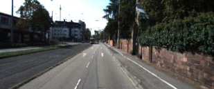  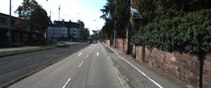 

### 2️⃣ VDISPARITY Map Generation  
- Create a **VDisparity map** from the disparity image.  
- Each row in the V-Disparity image represents a disparity histogram for that row in the disparity map.  
- Points on the ground plane appear as a distinct line in the VDisparity map.  

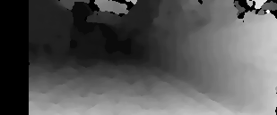  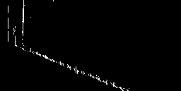 

### 3️⃣ Hough Transformation for Road Extraction  
- Apply **Hough Transformation** on the VDisparity image.  
- Extract lines that represent the road structure.  

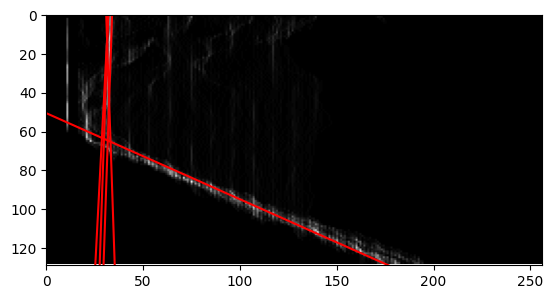 

### 4️⃣ Region of Interest (ROI) Extraction  
- Determine the **vanishing line** based on disparity values.  
- Points **above the vanishing line (high disparity) are removed**.  
- Obtain the **region of interest (ROI)** containing the road. 

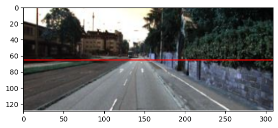 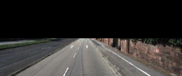 

### 5️⃣ Lane Line Detection with Threshold Filtering  
- Apply the **horizontal Sobel operator** on the ROI image to detect gradients.  
- Use **OTSU Thresholding** for binarization.  
- Apply **median filtering** to remove noise.  

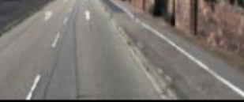 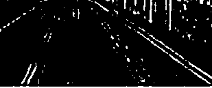 

### 6️⃣ Cycle Lane Detection  
- Identify **cycle lanes** characterized by **two full white lines** at the road edges.  
- Locate **base points** by detecting peaks in pixel distribution at the bottom of the image.  
- Utilize the **sliding window technique** to trace lines from base points.

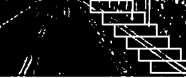 

### 7️⃣ Approximate Line Detection  
- Define **N** as the number of points in a line using sliding windows.  
- **N = H / h**, where **H** is the ROI height and **h** is the window height.  
- Approximate **N points** due to practical constraints.  
- If **n/N ≈ 0.1** (with **e = 0.1**), consider it as a **complete lane line**.  

### 8️⃣ Lane Marking  
- Use the detected lines to **mark lanes** on the image.  

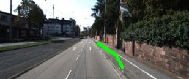 
